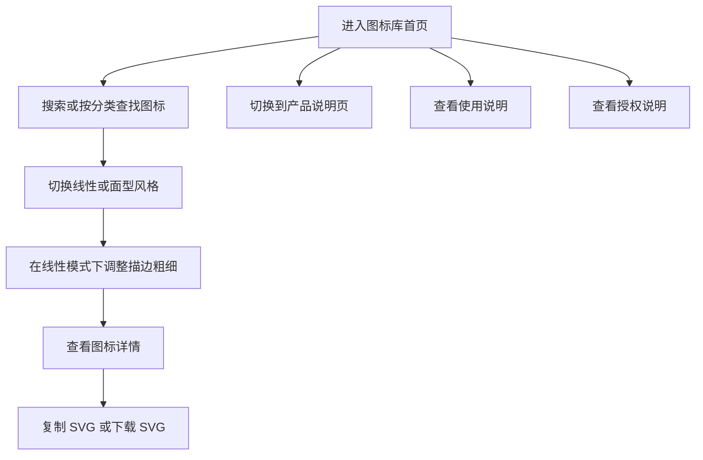

## 1. 产品概述
这是一个面向设计师和前端开发者的品牌官网型图标库网站，提供统一风格的图标浏览、搜索、预览、复制与下载能力
- 产品核心目标是建立一套有品牌识别度的图标体系，并提供清晰、顺手、专业的使用体验
- 第一版重点验证图标体系、官网展示能力和基础使用流程，不追求复杂社区功能

## 2. 核心功能

### 2.1 用户角色
本产品第一版不区分复杂角色，默认所有访问者均可直接使用核心功能

| 角色 | 使用方式 | 核心权限 |
|------|----------|----------|
| 访客用户 | 直接访问网站 | 浏览图标、搜索筛选、切换风格、调整线性描边、复制 SVG、下载 SVG、查看使用说明和授权说明 |

### 2.2 功能模块
1. **图标库首页**：图标列表展示、搜索、分类筛选、风格切换、背景切换、线性描边调节、快捷操作
2. **产品说明页**：品牌展示、产品价值说明、图标风格说明、使用场景说明
3. **图标详情面板**：大图预览、图标信息、风格切换、SVG 复制、SVG 下载
4. **使用说明页**：设计使用说明、开发使用说明、基础接入示例
5. **授权说明页**：免费可商用说明、使用边界、修改与分发规则

### 2.3 页面详情
| 页面名称 | 模块名称 | 功能说明 |
|-----------|-------------|---------------------|
| 图标库首页 | 顶部导航 | 图标库作为第一个导航入口，产品说明作为第二个导航入口 |
| 图标库首页 | 顶部工具栏 | 包含搜索框、分类切换、风格切换、背景切换 |
| 图标库首页 | 描边调节区 | 在线性模式下展示描边粗细控制，默认值为 1.5 |
| 图标库首页 | 图标网格区 | 以网格形式展示图标列表，支持悬停反馈 |
| 图标库首页 | 图标快捷操作 | 支持复制 SVG、下载 SVG、打开详情 |
| 图标库首页 | 空状态反馈 | 搜索无结果时给出清晰提示和返回方式 |
| 产品说明页 | 顶部导航 | 展示品牌名称、图标库入口、产品说明、使用说明、授权说明 |
| 产品说明页 | 首屏说明区 | 展示品牌主标题、副标题、核心价值点、进入图标库按钮 |
| 产品说明页 | 特色说明区 | 展示线性与面型双风格、24x24 统一尺寸、免费可商用等信息 |
| 产品说明页 | 图标预览区 | 展示精选图标样例，体现整体风格与品质 |
| 产品说明页 | 使用场景区 | 展示适合设计稿、网页、后台系统、移动端等典型场景 |
| 产品说明页 | 页脚 | 展示版权、授权入口、说明链接 |
| 图标详情面板 | 大图预览 | 展示当前图标在不同背景下的效果 |
| 图标详情面板 | 图标信息 | 展示名称、分类、关键词、风格类型 |
| 图标详情面板 | 操作区 | 支持切换风格、复制 SVG、下载 SVG |
| 使用说明页 | 设计使用说明 | 说明设计师如何下载与使用 SVG 图标 |
| 使用说明页 | 开发使用说明 | 说明前端如何使用 SVG 资源 |
| 使用说明页 | 使用建议 | 说明尺寸、描边与风格搭配建议 |
| 授权说明页 | 授权范围 | 明确免费可商用 |
| 授权说明页 | 使用规则 | 明确允许下载、修改、用于商业项目 |
| 授权说明页 | 风险提示 | 明确禁止冒充原创资源库或单独转售资源 |

## 3. 核心流程
用户进入网站后，首先直接看到图标库首页，优先完成搜索、分类、风格切换和描边预览等核心操作。若用户想了解产品理念、风格特点和使用场景，可切换到第二个导航页查看产品说明。找到目标图标后，用户可以直接复制 SVG 或下载 SVG。若用户希望了解使用方式或版权边界，可进入使用说明页和授权说明页查看详细内容

## 4. 用户界面设计
### 4.1 设计风格
- 主风格定位：参考 OpenAI Codex 官网的现代产品风格，简洁、理性、轻科技感
- 主色建议：白、浅灰、深石墨色为主，搭配少量蓝紫渐变高光
- 按钮风格：简洁圆角或微圆角，强调细节和质感
- 字体风格：整体使用现代无衬线字体，避免古典和装饰性字体
- 布局风格：桌面端优先，留白充足，网格规整，视觉节奏明确
- 图标展示风格：突出统一性、秩序感和细节品质

### 4.2 页面设计概览
| 页面名称 | 模块名称 | UI 元素 |
|-----------|-------------|-------------|
| 图标库首页 | 顶部工具栏 | 搜索框、分类切换标签、风格切换按钮、背景切换按钮 |
| 图标库首页 | 描边调节区 | 滑杆控件、默认值提示、仅在线性模式显示 |
| 图标库首页 | 图标网格区 | 高密度但整齐的卡片列表、悬停态、名称提示 |
| 产品说明页 | 首屏展示区 | 大标题、副标题、品牌口号、主按钮、精选图标预览、柔和过渡动画 |
| 产品说明页 | 特色说明区 | 简洁卡片或分栏说明、统一图标样例、重点数据强调 |
| 图标详情面板 | 预览区 | 大尺寸图标预览、浅色和深色背景切换 |
| 图标详情面板 | 操作区 | 风格切换按钮、复制按钮、下载按钮 |
| 使用说明页 | 内容区 | 清晰分段说明、示例代码块、提示信息 |
| 授权说明页 | 内容区 | 简洁规则列表、重点说明模块 |

### 4.3 响应式
- 采用桌面端优先设计
- 平板端保留完整核心功能，适当压缩布局宽度
- 移动端保证基础浏览、搜索、切换和下载功能可用
- 重点优化触控点击区域、搜索输入体验和详情面板展示方式

## 5. 产品规则与约束
- 第一版图标数量控制在 100 到 300 个
- 图标默认尺寸统一为 24 x 24
- 图标包含两套独立资源：线性版 SVG 与面型版 SVG
- 线性图标默认描边值为 1.5
- 第一版分类数量控制在 6 类
- 线性图标支持描边粗细调节
- 面型图标不支持描边粗细调节
- 第一版输出格式仅支持 SVG
- 产品授权方式为免费可商用

## 6. 第一版暂不包含内容
- 用户登录与账号系统
- 收藏夹与个人资源管理
- 社区上传、评论、审核机制
- Figma 插件
- React、Vue、Flutter 等多端组件包
- 在线图标编辑器
- 批量打包下载
- 多语言站点

## 7. 成功标准
- 用户打开首页后能快速理解产品定位和价值
- 用户进入图标库后能快速找到目标图标
- 用户可以顺畅完成风格切换、描边预览、复制和下载
- 网站整体风格有明显品牌感和设计品质
- 第一版能稳定承载后续图标数量增长和功能扩展
