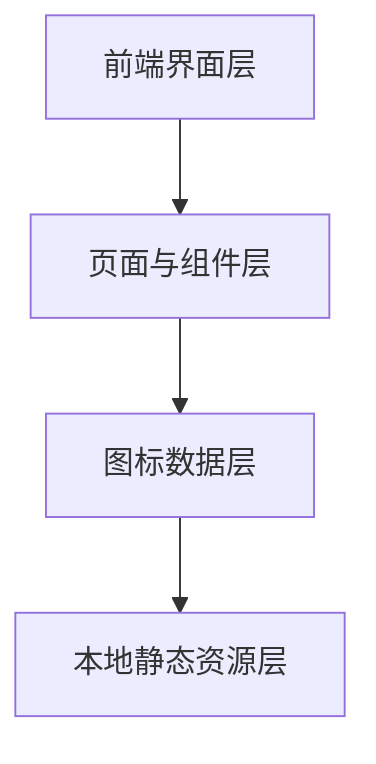

## 1. 架构设计


本项目第一版采用轻量前端架构，不依赖复杂后台服务。网站主要由前端页面、图标数据配置和本地 SVG 资源组成，适合快速上线和后续逐步扩展

## 2. 技术说明
- 前端：React 18 + Vite
- 样式方案：Tailwind CSS 3
- 图标数据管理：本地 JSON 或 TypeScript 数据文件
- 资源形式：本地 SVG 文件
- 部署方式：静态站点部署

## 3. 路由定义
| 路由 | 用途 |
|-------|---------|
| / | 图标库首页 |
| /about | 产品说明页 |
| /guide | 使用说明页 |
| /license | 授权说明页 |

## 4. 数据定义
### 4.1 图标数据模型
```ts
type IconCategory =
  | "basic"
  | "arrow"
  | "edit"
  | "media"
  | "system"
  | "brand"

type IconItem = {
  id: string
  name: string
  category: IconCategory
  keywords: string[]
  linearSvg: string
  filledSvg: string
}
```

### 4.2 交互状态模型
```ts
type IconStyleMode = "linear" | "filled"

type PreviewBackground = "light" | "dark"

type IconLibraryState = {
  keyword: string
  category: IconCategory | "all"
  styleMode: IconStyleMode
  strokeWidth: number
  background: PreviewBackground
  selectedIconId: string | null
}
```

## 5. 页面职责说明
| 页面 | 核心职责 |
|------|----------|
| 图标库首页 | 提供搜索、筛选、预览、切换、复制、下载等核心使用能力 |
| 产品说明页 | 建立品牌印象，介绍图标库价值、风格特点和使用场景 |
| 使用说明页 | 讲清设计使用方式与开发接入方式 |
| 授权说明页 | 明确免费可商用规则和使用边界 |

## 6. 关键交互规则
- 风格切换支持在线性与面型之间快速切换
- 描边调节仅在线性模式下展示和生效
- 切换到面型模式时，描边滑杆隐藏
- 点击图标卡片后打开详情面板
- 复制 SVG 时复制当前选中风格对应的 SVG 内容
- 下载 SVG 时下载当前选中风格对应的 SVG 文件
- 整体站点界面采用浅色工具型视觉，图标库优先作为首屏入口

## 7. 扩展预留
- 后续可接入后台管理图标数据
- 后续可增加多格式导出能力
- 后续可增加收藏、组件包、Figma 插件等功能
